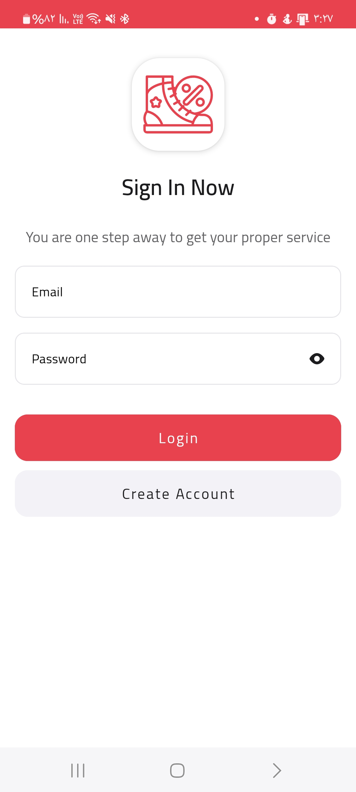
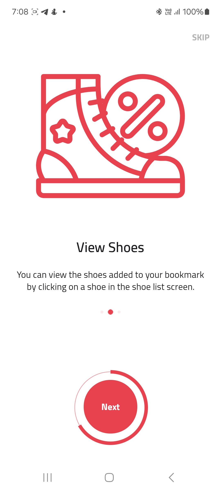
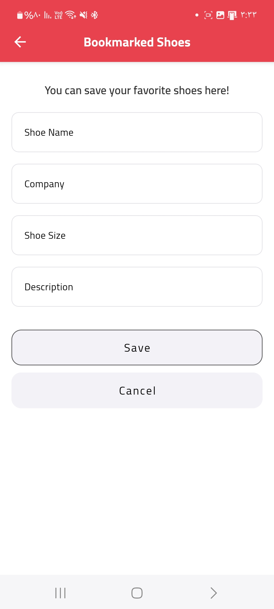
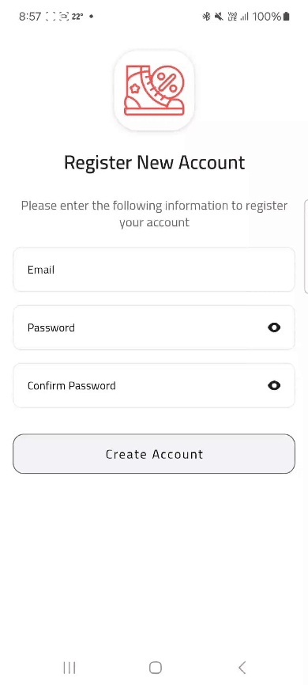
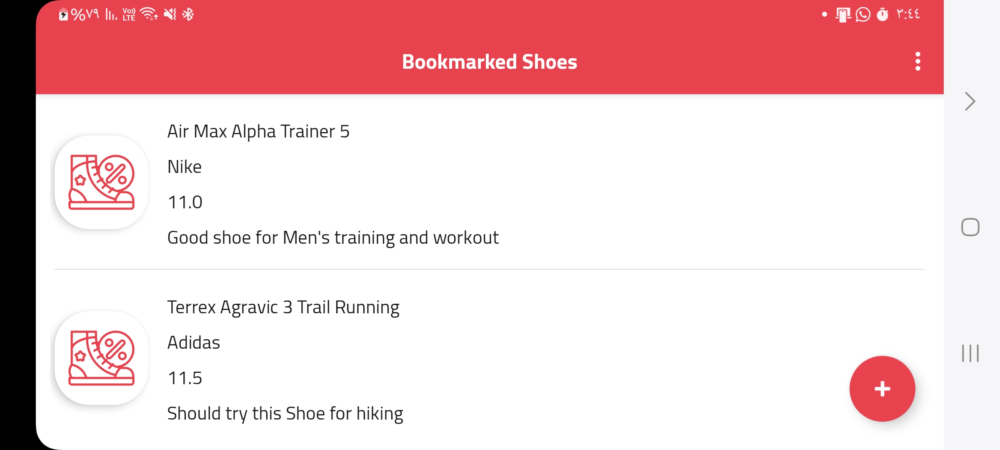

# ShoeStore

SheoStore is an app for bookmarking your favorite shoes, it has been developed for **Udacity Android Kotlin Developer Nanodegree Program**.

The main features of this realese are:
* Implement MVVM Design Pattern.
* Ability to create your own bookmarked shoes list and save Data inside SharedViewModel.
* Implement Clean Architecture.
* Using the App in Landscape and Portrait mode without any data missing or reloading the data.
* Implement simplified layout using ConstraintLayout only or non-nested LinearLayout or FrameLayout.
* Implement the power of DatabindingAdapter.
* Implement Koin for Dependency injection.
* Implement Flow to create dynamic filling forms.
* Implement Single Activity and multiple fragments Design Patterns.
* Onboarding screen.

What External library used:
-------

* [Timber](https://github.com/JakeWharton/timber), for code logging.

* [Glidev4](http://bumptech.github.io/glide/doc/getting-started.html), for loading and fetching photos.

* [Koin](https://github.com/johncarl81/parceler), for dependany injection.

* [CircleIndicator](https://github.com/ongakuer/CircleIndicator), for ViewPager pages indicator.

* [CircularProgressBar](https://github.com/lopspower/CircularProgressBar), for Circular Progress for Onboarding screens.

* [KSP](https://developer.android.com/build/migrate-to-ksp), for annotation processors compiler plugins.

Useful links:
-------

* [Android Kotlin Developer Nanodegree Program](https://www.udacity.com/course/android-kotlin-developer-nanodegree--nd940), for full details of the Program and its related projects.
* [Starter Project Code](https://github.com/udacity/nd940-android-kotlin-course1-starter), for the starter code of the Project.
* [Project Rubric](https://docs.google.com/document/d/1n1vvMoQ_cv2E9NDcej7WDQMTqsY096dTPyh7Alkb1_0/edit?usp=sharing), for the Project Rubric.

Snapshots from the app:
-------
* Phone Screens (Portrait):

    
   
   
   

* Phone Screens (Landscape):

  

