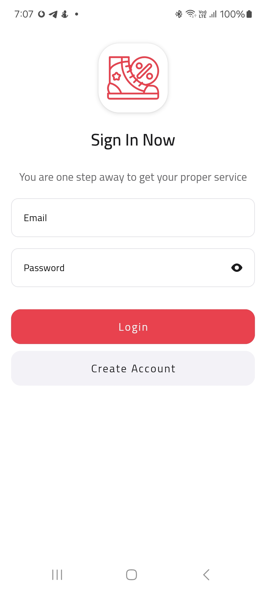
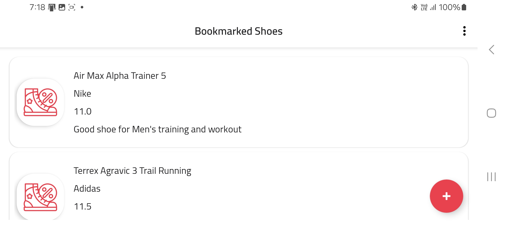

# ShoeStore

ShoeStore is an app designed to help users catalog and bookmark their favorite shoes, providing a simple and organized way to save and manage a personalized shoe collection.
It was developed as the first Project of the **Udacity Android Kotlin Developer Nanodegree Program**.

_**Offline feature for this Project isn't required, and it's included in Project02 and Project04.**_

Main Feature Of The Project:
-------
- Implement MVVM Design Pattern and Clean Architecture.
- Ability to create your own bookmarked shoes list and save Data inside SharedViewModel.
- Using the App in Landscape and Portrait mode without any data missing or reloading the data.
- Implement simplified layouts using ConstraintLayout only or non-nested LinearLayout or FrameLayout.
- Implement the power of DatabindingAdapter.
- Implement Koin for Dependency injection.
- Implement Flow to create dynamic filling forms.
- Implement Single Activity and multiple fragments Design Patterns.
- Implement Jetpack DataStore to store and retrieve user preferences asynchronously.
- Onboarding Screen.

Useful Links:
-------
- [Starter Project Code](https://github.com/udacity/nd940-android-kotlin-course1-starter), for the starter code of the Project.
- [Project Rubric](https://docs.google.com/document/d/1n1vvMoQ_cv2E9NDcej7WDQMTqsY096dTPyh7Alkb1_0/edit?usp=sharing), for the Project Rubric.
- [Android Kotlin Developer Nanodegree Program](https://www.udacity.com/course/android-kotlin-developer-nanodegree--nd940), for the full details of the Program and its related projects.

Installation Guide:
-------
- This project doesn't require any special installation setup.
- The project is built using Android Studio **Ladybug (2024.2.1 Patch2)**, and **Gradle Plugin v(8.7.2)**.
  
Included External Libraries:
-------
- [Koin v4](https://github.com/johncarl81/parceler), for dependany injection.
- [Timber](https://github.com/JakeWharton/timber), for code logging.
- [Glide v4](http://bumptech.github.io/glide/doc/getting-started.html), for loading and fetching photos.
- [KSP](https://developer.android.com/build/migrate-to-ksp), for annotation processors plugins compiler.
- [DatasStore](https://developer.android.com/topic/libraries/architecture/datastore), for storing and retrieving user preferences asynchronously.
- [Security Crypto](https://developer.android.com/jetpack/androidx/releases/security), for encryption of user-sensitive data.
- [CircleIndicator](https://github.com/ongakuer/CircleIndicator), for ViewPager pages indicator.
- [CircularProgressBar](https://github.com/lopspower/CircularProgressBar), for Circular Progress for Onboarding screens.

Snapshots from the app:
-------
### Phone Screens (Portrait):

<table>
  <tr>
    <td>
      

      

      
      
<strong>Login Screen</strong>

      

    </td>
    <td>
      

      

      
      
<strong>Onboarding Screen</strong>

      

    </td>
  </tr>
  <tr>
    <td>
      

      

      
      
<strong>Add Shoe to Bookmark</strong>

      

    </td>
    <td>
      

      

      
      
<strong>Dynamic Filling Form</strong>

      

    </td>
  </tr>
</table>

### Phone Screens (Landscape):

  

    
    
<strong>Bookmark List in Landscape Mode</strong>

  

License:
-------
The content of this repository is licensed under [Apache 2.0 License](https://www.apache.org/licenses/LICENSE-2.0).
