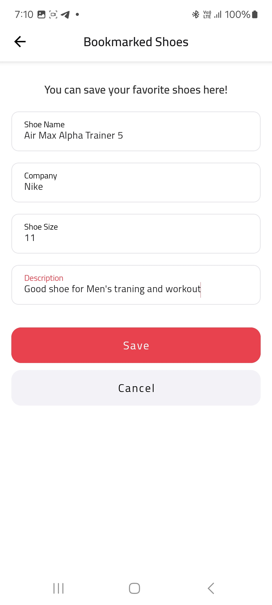

# ShoeStore

ShoeStore is an app designed to help users catalog and bookmark their favorite shoes, providing a simple and organized way to save and manage a personalized shoe collection. It was developed as the first project of the **Udacity Android Kotlin Developer Nanodegree Program**.

**Note**: Offline functionality is not required for this particular project, but it is implemented in [Project02](https://github.com/AliElDerawi/AsteroidRadar) and [Project04](https://github.com/AliElDerawi/LocationReminders).

## Main Features of the Project

- Uses MVVM Design Pattern and Clean Architecture.
- Allows users to create their own bookmarked shoe list and saves data inside SharedViewModel.
- Supports both landscape and portrait modes without data loss or reloading.
- Implements simplified layouts using ConstraintLayout, LinearLayout, or FrameLayout.
- Integrates DataBindingAdapter for reactive UI components.
- Implements Koin for Dependency Injection.
- Uses Kotlin Flow for dynamic filling forms.
- Features a single activity with multiple fragments (Single Activity Architecture).
- Implements Jetpack DataStore for storing and retrieving user preferences asynchronously.
- Includes an onboarding screen to enhance user experience.

## Useful Links

- [Starter Project Code](https://github.com/udacity/nd940-android-kotlin-course1-starter): Get the starter code for the project.
- [Project Rubric](https://docs.google.com/document/d/1n1vvMoQ_cv2E9NDcej7WDQMTqsY096dTPyh7Alkb1_0/edit?usp=sharing): View the project rubric.
- [Android Kotlin Developer Nanodegree Program](https://www.udacity.com/course/android-kotlin-developer-nanodegree--nd940): Learn more about the full program and its related projects.

## Installation Guide

This project does not require any special installation setup. Follow these steps:

- Clone the repository using Git.
- Open the project in Android Studio **Ladybug (2024.2.1 Patch2)**.
- Build the project using **Gradle Plugin v(8.7.2)**.

## Included External Libraries

- [Koin v4](https://insert-correct-url), for dependency injection.
- [Timber](https://github.com/JakeWharton/timber), for logging.
- [Glide v4](http://bumptech.github.io/glide/doc/getting-started.html), for loading and fetching photos.
- [KSP](https://developer.android.com/build/migrate-to-ksp), for annotation processors plugin compiler.
- [DataStore](https://developer.android.com/topic/libraries/architecture/datastore), for storing and retrieving user preferences asynchronously.
- [Security Crypto](https://developer.android.com/jetpack/androidx/releases/security), for encryption of user-sensitive data.
- [CircleIndicator](https://github.com/ongakuer/CircleIndicator), for ViewPager page indicators.
- [CircularProgressBar](https://github.com/lopspower/CircularProgressBar), for onboarding screen progress indication.

## Snapshots from the App

### Phone Screens (Portrait)

<table>
  <tr>
    <td align="center">
      
      
<strong>Login Screen</strong>

    </td>
    <td align="center">
      
      
<strong>Onboarding Screen</strong>

    </td>
  </tr>
  <tr>
    <td align="center">
      
      
<strong>Add Shoe to Bookmark</strong>

    </td>
    <td align="center">
      
      
<strong>Dynamic Filling Form</strong>

    </td>
  </tr>
</table>

### Phone Screens (Landscape)

  
  
<strong>Bookmark List in Landscape Mode</strong>

## License

The content of this repository is licensed under [Apache 2.0 License](https://www.apache.org/licenses/LICENSE-2.0).
